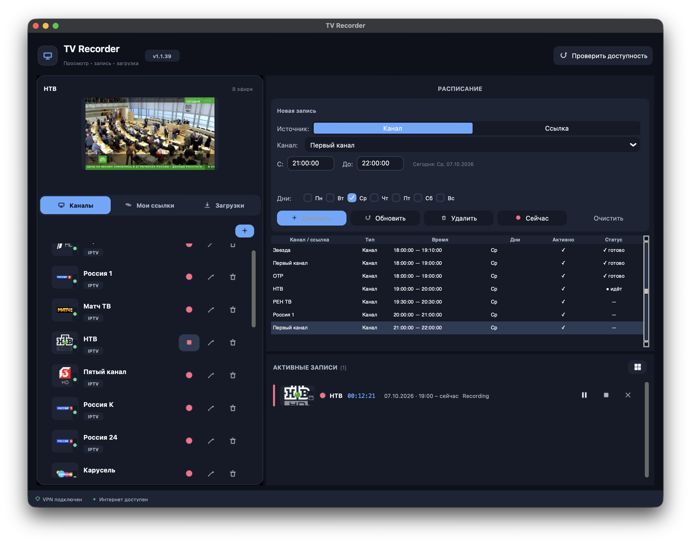

# TV Recorder

> **English** · [Русская версия](README_RU.md)

TV Recorder is a macOS app for watching and recording live TV, saving web
video, and scheduling recordings. It combines a compact desktop interface with
a resilient FFmpeg pipeline designed for sources that may briefly disconnect or
change quality.



Live preview, scheduled recordings, and recording progress in one window.

## Highlights

- **Live channels** — import any M3U playlist, preview a channel, check its
  availability, and record several channels at the same time.
- **Web links** — resolve YouTube, VK, RuTube, Twitch, 1tv.ru, Smotrim,
  TV Zvezda, embedded players, and many other pages through a layered resolver.
- **Downloads** — save a video once at the chosen quality with progress, speed,
  ETA, cancellation, and final media validation.
- **Schedule** — record channels or saved links by weekday and time range, with
  accurate stopping at the configured deadline.
- **Screen capture fallback** — when a direct stream cannot be extracted, the
  app can ask permission and record the visible browser player instead.

## Recording reliability

TV Recorder is built to preserve useful output when a source is unstable:

- reconnects on network, TLS, HTTP 4xx/5xx, and read-timeout failures;
- retries failed HLS segments instead of ending the whole recording;
- selects a practical HLS rendition rather than blindly choosing the largest;
- starts live HLS close to the current edge to avoid expired DVR segments;
- validates completed files with `ffprobe` and reports **completed**,
  **partially saved**, or **processing error**;
- shuts down FFmpeg, downloads, previews, timers, and browser capture cleanly.

No recorder can recover media that the source never delivered. Signed stream
URLs may also expire during a very long recording, but short outages and bad
segments are handled automatically.

## Supported workflow

1. Open **Channels**, **My Links**, or **Downloads**.
2. Preview a source or start recording immediately.
3. Select a source in **Schedule** to create a recurring recording.
4. Follow active jobs in the recording panel or grid monitor.
5. Reveal the finished MP4 in Finder.

Recordings are stored in `~/Movies/TV Recorder/recordings` and downloads in
`~/Movies/TV Recorder/downloads` in the packaged app. Both folders can be
changed in Settings.

## Install the macOS app

**Version 1.1.39 is available as a ready-to-install DMG for Apple Silicon Macs.**
Download [TV Recorder 1.1.39 — DMG](https://github.com/sirdimitry/TV_recorder/releases/download/v1.1.39/TV_Recorder_v1.1.39_Apple_Silicon.dmg)
or see the [release notes and SHA-256 checksum](https://github.com/sirdimitry/TV_recorder/releases/tag/v1.1.39).

Download the [latest ready-to-install DMG](https://github.com/sirdimitry/TV_recorder/releases/latest) from GitHub, open it, and drag **TV Recorder** to **Applications**.
The [latest release page](https://github.com/sirdimitry/TV_recorder/releases/latest) lists the current version and its installer.
The app is ad-hoc signed and is not Apple-notarized, so macOS
may require **Control-click → Open** on the first launch.

Screen recording fallback requires macOS permission in **System Settings →
Privacy & Security → Screen & System Audio Recording**. Audio capture also
requires a loopback device such as BlackHole.

## Feedback and ideas

You're welcome to install TV Recorder and give it a try. If you enjoy using it,
I'd be grateful for a few words about your experience. Suggestions are welcome
too: what could work better, or what feature would you like to see?
Feel free to share your feedback in [GitHub Issues](https://github.com/sirdimitry/TV_recorder/issues).

If you'd like to support the project, a ⭐ on GitHub would be much appreciated.
Thank you for trying TV Recorder and helping it improve!

## Run from source

Requirements: macOS 12+, Python 3.12+, and FFmpeg with `ffplay` and `ffprobe`.

```bash
git clone https://github.com/sirdimitry/TV_recorder.git
cd TV_recorder
brew install ffmpeg
python3 -m pip install -r requirements.txt
python3 main.py
```

If a supported website stops resolving after a site update, upgrade yt-dlp:

```bash
python3 -m pip install --upgrade yt-dlp
```

## Build a DMG

```bash
bash packaging/build.sh
bash packaging/make_dmg.sh
```

The result is written to `packaging/TV_Recorder_v<version>_Apple_Silicon.dmg`.

## Project structure

```text
core/       Recording, downloading, scheduling, stream resolution, storage
gui/        CustomTkinter interface and browser capture
utils/      Configuration, icons, logging, network and filename helpers
data/       Bundled fallback channel list and local runtime data
packaging/  PyInstaller app and DMG scripts
tests/      Reliability and regression tests
```

## Credits

- [FFmpeg](https://ffmpeg.org/) — playback, recording, muxing, and validation.
- [yt-dlp](https://github.com/yt-dlp/yt-dlp) — web media extraction.
- [IPTVru](https://github.com/smolnp/IPTVru) — one available channel discovery
  source used by the default setup.
- Some logo URLs originate from source playlists and Wikimedia Commons.

TV Recorder is independent and is not affiliated with broadcasters or content
providers. Users are responsible for respecting applicable rights and terms.

## License

MIT — see [LICENSE](LICENSE).
